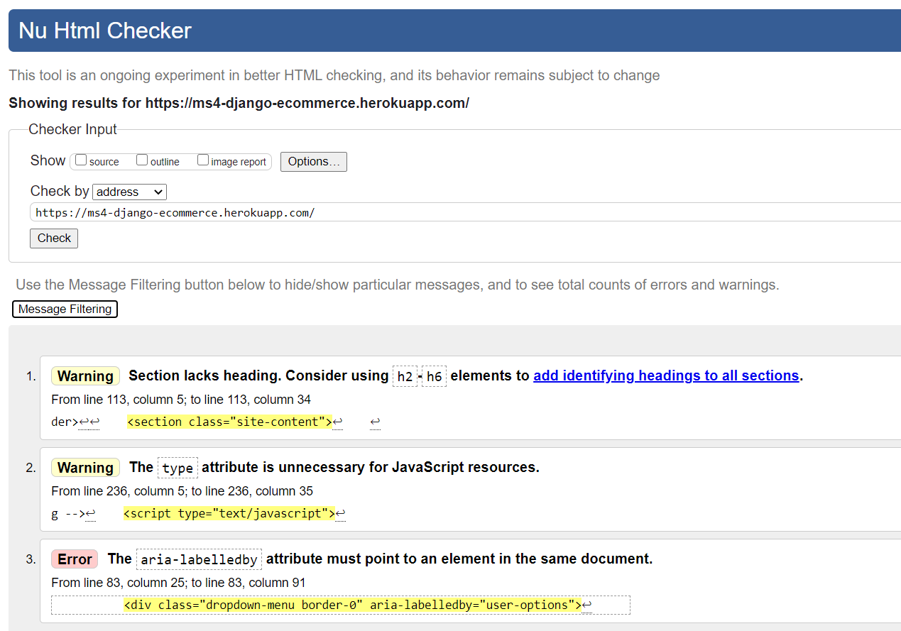
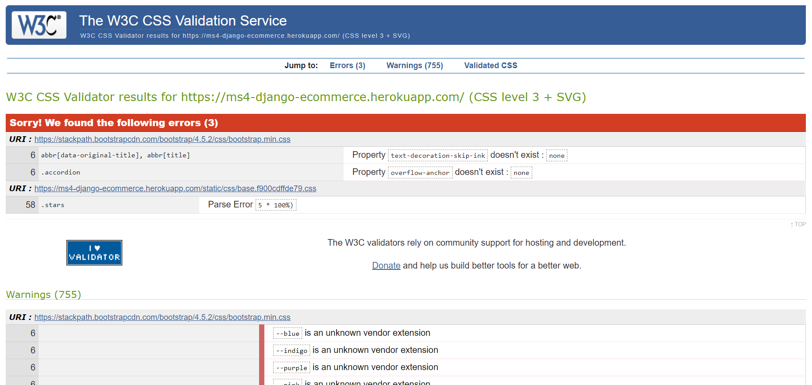

# Medb

This project is designed to be a simple e-commerce site selling software. The project serves to demonstrate my ability and understanding of Django.


## Table of Contents:
1. [**Project Overview**](#project-overview)
2. [**UX**](#UX)
    - [**User Stories**](#user-stories)
    - [**Mockup**](#mockup)
3. [**Features**](#features)
    - [**Header**](#header)
    - [**Home Page**](#home-page)
    - [**Store**](#store)
    - [**Product Detail Page**](#product-detail-page)
    - [**Login / Register Page**](#login-/-register-page)
    - [**Profile**](#profile)
    - [**Cart**](#cart)
    - [**Checkout**](#checkout)
    - [**Footer**](#footer)
4. [**Technologies**](#technologies)
    - [**Pips**](#pips)
5. [**Testing**](#testing)
    - [**HTML Validator**](#html-validator)
    - [**CSS Validator**](#css-validator)
    - [**Automatic Testing**](#automatic-testing)
6. [**Deployment**](#deployment)
7. [**Bugs**](#bugs)
    - [**Registration Redirect**](#registration-redirect)
    - [**Stripe and Profiles**](#stripe-and-profiles)
9. [**Self-Reflection**](#self-reflection)
10. [**Credits**](#credits)
    - [**Icons**](#icons)


## Project Overview

The goal of this site is to sell all kind of software to users. With the users being able to add each individual item into their cart, and remove them, before checking out their purchase. 


## UX

### User Stories

- As an user, I want to be able to browse through the sites collection of items.
- As an user, I want to be able to view the details of each individual item.
- As an user, I want to be able to add items into a cart so I can purchase in bulk.
- As an user, I want to be able to view all the items in my cart.
- As an user, I want to be able to remove an item from the cart.
- As an user, I want to be able to navigate to to each item from the cart.
- As an user, I want to be able to see both the total cost of all items in my cart and each individual item.
- As an user, I want to be able to purchase my items through a secure method.
- As an user, I want to be able to view the history of my purchases.
- As an user, I want to be able to view each individual license for the software I purchases.

### Mockup

A link that takes you to the mockup I made for this project. **Note, that the links take you to a PDF file and do not display an image!**

The mockup was made before work began on the project as a general guide on how to design the project. And as so does not reflect the final design as seen on the live production site.

- 

## Features

### Header:

The header contains the logo to the site which when clicked will take the user to the home page. Along side that there are four additional icons.

A search icon which when clicked will open up the search bar for the store.

An user icon which will take the user to the login/register page or their profile depending if they are currently logged in.

A cart icon which will display all the users items if they have any in the cart.

And a burger icon which when clicked will open a dropdown with links to other pages of the site.

### Home Page: 

A simple page with a carousel showing either three products that are currently on sale, or showing three random products. The carousel slides can be scrolled through using either the arrows or highlighters below.

The user can click either the products name or price to be taken to its details page.

### Store Page:

The page will display all the products that the user can purchase in neat little cards.

If a product/s is currently on sale it will display at the top of the store with a title indicating that the product is on a sale. If no product is on sale than no on sale title will be present.

The user will be able to sort the order of the products with the select menu near the title of the products list.

Each product card contains an image, the products name, description, rating, price, and an option to add the product to their cart. Clicking on either the image or title will take the user to that products detail page.

### Product Detail Page:

This page will reiterate all the information about the product just like the products card on the store page albeit in a nicer, easier to read format.

If the product is currently on sale, their will be an indicator on the page notifying the user of this detail.

The user will be able to add the product to their cart if they are signed in.

### Login / Register Page:

A brief page containing either a login and register form.

### Profile:

On the users profile the user will be able to see their username and email, their order history, and all the software licenses that they have bought in the store.

The user will also be able to change their password here through a change password form. As well as manage their emails addresses.

The user is able to manage their email addresses by adding new ones, deleting unwanted ones, and making an email their primary address.

The users profile data will be displayed here. The user can choose to leave it blank and fill it in at checkout or here.

### Cart

When a user click the shopping cart icon without any items in the cart, the user will be redirected to a page telling them that no items are currently in their cart with a button displayed which when clicked will take the user to the products page.

If the user has items in the cart, the user will then be taken to a page where they will see all their current cart items, both their individual and total cost, as well as the option to remove the item from their cart.

From here the user is able to head towards the checkout page.

Each time an item is added to the cart, a toast will pop out notifying the user of their action. The user is able to go to checkout with this toast in addition to the cart page.

### Checkout

On the checkout page the user will be greeted by the payment form on the left, and their cart on the right showing all the before-mentioned cart information.

If the user is not logged in at this step, they won't be able to complete their order as the complete order button will not be displayed but rather a login button will take its place.

If the user is indeed logged in, then the user will be able to complete their oder.

### Footer:

The footer contains some information about the store and contains the links to all manners of legal pages.


## Technologies

The list of technologies and third-party packages used in the making of this project:

- **HTML5:** HTML5: Modern HTML to form the structure of the site.
- **CSS3:** Used to style the site along with Flexbox and Grid.
- **JS:** Used for the logic between HTML elements and interaction between the user and the site.
- **Python3:** Used to create the backend and data-manipulation portion of the project.
- **Django:** A Python based web-framework used to create the templates and function views for the project.
- **Git:** Used for version control from the very beginning of the project.
- **Github:** A remote repository used to store the source code for the project.
- **Heroku:** A third-party hosting service used to deploy the live project.
- **VsCode:** Source code editor used to write, edit, test, and debug the source code.

### Pips

Along with the technologies listed above, I've also used the following pips while making this project:

- **[Allauth](https://django-allauth.readthedocs.io/en/latest/index.html):** An authentication and account management 3rd party tool.
- **[Gunicorn](https://gunicorn.org/):** A Python web service gateway used for easier integration to Heroku.
- **[Stripe](https://stripe.com/):** A payment processing software.

For any additional pips please refer to the requirements.txt file.

## Testing

### HTML Validator

The result of the HTML Validator can be seen in the image below:



### CSS Validator

The result of the CSS Validator can be seen in the image below:



### Automatic Testing

For this project a few automatic tests have been made.

In order to run all the test you'd have to run this command in the command terminal:

```
python manage.py test
```

Or, if you want to run the test for a single app:

```
python manage.py test <app name>
```


## Deployment

The process it took to deploy this project goes as follows:

1. Download and install **[Python](https://www.python.org/)**.
2. Clone the repository
```
git clone https://github.com/Zylashro/django-ecommerce.git
```
3. Move into the folder
```
cd django-ecommerce
```
4. Create and activate your virtual environment
```
python venv -m <environment name>
```
5. Install requirements with pip
```
pip install -r requirements.txt
```
6. Log into **[Heroku](https://www.heroku.com/home)**.
7. Create a new Heroku project, and configure all the necessary settings.
8. Once a project is created, manuever to the Settings tab and configure the **Confiq Vars**.
9. For this project those vars were:
    - SECRET_KEY
    - DATABASE_URL
    - STRIPE_PUBLIC_KEY
    - STRIPE_SECRET_KEY
    - STRIPE_WH_SECRET
    - EMAIL_HOST_USER
    - EMAIL_HOST_PASS
    - ENV_ROLE
10. Head on towards the Resources tab and on add-ons add **Heroku Postgres**.
11. Start the app locally
```
python manage.py runserver
```

## Bugs

There are a few known bugs in the code. Some more pressing than others.

The current bugs that I have found consist of two issues.

### Registration Redirect

When the user clicks the sing up button on the registration page, Heroku crashes the page. The user's registration still goes through.

### Stripe and Profiles

On the checkout page, once the user has entered all the necessary information and click the confirm oder button, the button becomes unclickable and nothing happens.

On the backend side of things, the order does go through as confirmed by Stripe getting and logging this payment event.

Sadly, the user can't do anything on the checkout page after clicking the confirm order button.

After confirming the order and going to the users profile, both the order history and license sections of the profile remain empty as if no purchase has been made.

If the user goes back to their cart, they will find that the product that they have "bought" is still in the cart.

## Self-Reflection

Initially, for this project I planned using Django to handle the backend logic and for React to handle the frontend logic for this project. And about a week into it, I figure out that the routing I would need to do to make both Django and React play nice together was a bit too big a hurdle to tackle given the time constrains I had.

Had to start over from scratch with pure Django by my side, and for the week or so I had to finish this, I am pretty happy with what I've managed to do.

Sadly their are bugs in the code which I didn't have the time to address. And my testing could have been more throughout in almost every sense of the word.

So far, this has been the most stressful, and emotionally draining project thus far. But it had thought me a great deal about working in a very small time-frame.


## Credits

The project would not be possible without the following:

### Icons

The icons pulled for this project come from [Font Awesome](https://fontawesome.com/).
